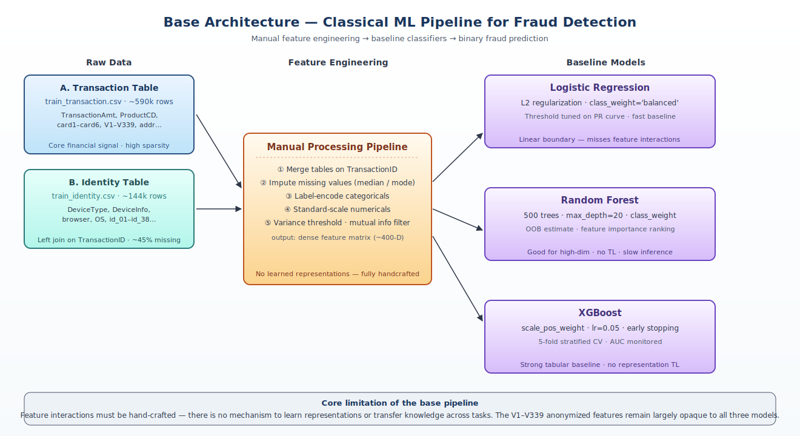
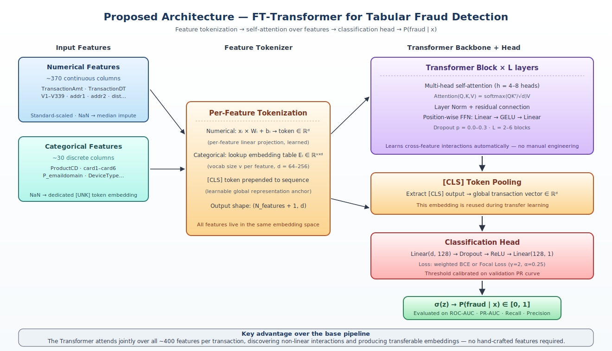
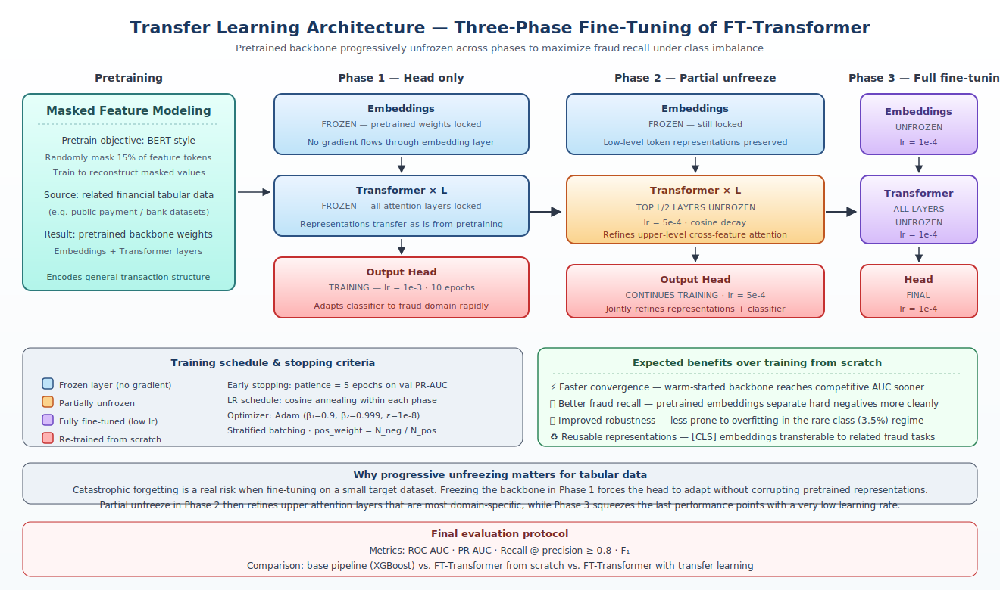

# Fraud Detection with Transfer Learning (IEEE-CIS)

**Universidad EAFIT — Neural Networks and Deep Learning (2026-1)**  
**Author:** Jaider España

> A deep learning system for fraud detection in online transactions using transfer learning over high-dimensional tabular data. The project leverages representation learning to improve detection performance under extreme class imbalance and complex feature interactions.

---

## Table of Contents

1. [Problem Statement](#1-problem-statement)
2. [Dataset](#2-dataset)
3. [Base Architecture](#3-base-architecture)
4. [Proposed Architecture](#4-proposed-architecture)
5. [Transfer Learning Strategy](#5-transfer-learning-strategy)
6. [Data Challenges & Mitigations](#6-data-challenges--mitigations)
7. [Roadmap](#7-roadmap)
8. [References](#8-references)

---

## 1. Problem Statement

### 1.1 Domain

Fraud detection in e-commerce involves identifying malicious activity within large-scale payment systems before it causes financial harm. The challenge combines high transaction volume, adversarial patterns, and severe label scarcity.

This project is grounded in the **[IEEE-CIS Fraud Detection](https://www.kaggle.com/c/ieee-fraud-detection)** Kaggle competition, released in collaboration with Vesta Corporation and the IEEE Computational Intelligence Society.

### 1.2 Problem formulation

We define a binary classification problem over a transaction dataset $\mathcal{D}$:

$$\mathcal{D} = \{(x_i, y_i)\}_{i=1}^{N}, \quad x_i \in \mathbb{R}^d,\; y_i \in \{0,1\}$$

The model learns:

$$f_\theta(x) = P(y = 1 \mid x)$$

where $d \approx 400$ features per transaction and $y = 1$ denotes a fraudulent transaction.

### 1.3 Why this is hard

| Challenge | Description |
|-----------|-------------|
| **Extreme dimensionality** | ~400 heterogeneous features, many anonymized (V1–V339) |
| **Severe class imbalance** | ~3–4% fraud rate — naive classifiers predict majority class |
| **Anonymized features** | V-columns carry hidden semantics; no domain label available |
| **Non-linear dependencies** | Fraud patterns emerge from interactions between dozens of features |
| **Missing data** | High sparsity across the identity table (~45% missing cells) |

### 1.4 Evaluation metrics

| Metric | Role |
|--------|------|
| **ROC-AUC** | Global discrimination ability |
| **PR-AUC** | Key metric under imbalance (penalizes false positives heavily) |
| **Recall** | Fraud sensitivity — catching real fraud events |
| **Precision** | False positive control — operational cost management |

---

## 2. Dataset

The IEEE-CIS dataset consists of two tables that are merged at training time:

| File | Rows | Description |
|------|------|-------------|
| `train_transaction.csv` | ~590k | Core transaction records |
| `train_identity.csv` | ~144k | Device and user metadata (left join on `TransactionID`) |

### 2.1 Feature groups

| Group | Features | Notes |
|-------|----------|-------|
| Transaction | `TransactionAmt`, `ProductCD`, card info | Core financial signal |
| Temporal | `TransactionDT` | Unix-delta from a reference date |
| Anonymized (V) | `V1`–`V339` | Engineered by Vesta — semantics unknown |
| Identity | `DeviceType`, `DeviceInfo`, browser | High missingness (~45%) |
| Address | `addr1`, `addr2` | Billing/shipping region codes |
| Email | `P_emaildomain`, `R_emaildomain` | Purchaser/recipient domain |

### 2.2 Data processing pipeline

```
train_transaction.csv ──┐
                        ├──► Left join on TransactionID
train_identity.csv ─────┘
         │
         ▼
  Handle missing values
  (median imputation / learned embedding for NaN)
         │
         ▼
  Encode categoricals
  (label encoding for embeddings; ordinal for trees)
         │
         ▼
  Normalize numericals
  (standard scaler applied per column)
         │
         ▼
  Feature selection / dimensionality reduction
  (variance threshold, mutual information, PCA optional)
         │
         ▼
  Stratified train/validation split
  (preserves ~3.5% fraud rate)
```

---

## 3. Base Architecture

The baseline serves as a performance floor and a feature-importance guide for the deep model.

### 3.1 Models

| Model | Strengths | Weaknesses |
|-------|-----------|------------|
| **Logistic Regression** | Interpretable, fast | Linear decision boundary; misses interactions |
| **Random Forest** | Handles missingness, robust | No representation transfer |
| **XGBoost** | State-of-the-art on tabular | Requires manual feature engineering; no TL |

### 3.2 Training procedure

All baseline models are trained with:

- **Class weighting** proportional to inverse frequency (`scale_pos_weight` in XGBoost)
- **5-fold stratified cross-validation**
- **Threshold tuning** on the validation PR curve to maximize F1

### 3.3 Limitations

The classical pipeline bottlenecks at manual feature engineering: each new interaction term must be hand-crafted. There is no mechanism to transfer representations across datasets or tasks, and high-dimensional anonymized features remain largely opaque.



---

## 4. Proposed Architecture

We adopt the **Feature Tokenizer + Transformer (FT-Transformer)** ([Gorishniy et al., 2021](https://arxiv.org/abs/2106.11959)), which was shown to match or outperform gradient-boosted trees on several tabular benchmarks.

### 4.1 Architecture overview

```
Numerical features ──┐
                      ├──► Feature Tokenizer
Categorical features ─┘       (per-feature linear/embedding → token matrix)
                                │
                                ▼
                    ┌─────────────────────────┐
                    │  Transformer Block × L   │
                    │  Multi-head attention    │
                    │  Layer Norm + FFN        │
                    │  Residual connections    │
                    └─────────────────────────┘
                                │
                                ▼
                       [CLS] token pooling
                    (global transaction vector)
                                │
                                ▼
                         Dense head
                    (Linear → Dropout → ReLU)
                                │
                                ▼
                         σ(z) → P(fraud | x)
```

### 4.2 Key design choices

**Feature tokenization.** Each feature — numerical or categorical — is projected into a shared embedding space with a learned linear layer (for numericals) or an embedding table (for categoricals). This allows the Transformer to treat all features as tokens on the same footing.

**Self-attention over features.** The Transformer applies multi-head self-attention across the token sequence (one token per feature). This lets the model learn arbitrary pairwise and higher-order interactions without manual engineering.

**[CLS] pooling.** A learnable `[CLS]` token is prepended to the sequence. After the last Transformer block, its output serves as the global transaction representation passed to the classification head.

**Focal loss (optional).** For hard negatives, we optionally replace weighted BCE with focal loss to down-weight easy negatives and focus learning on ambiguous fraud patterns.

### 4.3 Hyperparameters (initial search space)

| Parameter | Range |
|-----------|-------|
| Embedding dim $d$ | 64 – 256 |
| Transformer layers $L$ | 2 – 6 |
| Attention heads | 4 – 8 |
| Dropout | 0.0 – 0.3 |
| Learning rate | 1e-4 – 5e-3 |



---

## 5. Transfer Learning Strategy

### 5.1 Motivation

Training an FT-Transformer from scratch on a ~590k tabular dataset is sample-inefficient in the high-dimensional regime. Representations pretrained on a related tabular corpus (e.g., another financial transaction dataset) encode general notions of "transaction similarity" that can be adapted rather than relearned.

### 5.2 Pretraining objective

We pretrain the backbone using a **masked feature modeling** objective: randomly mask a subset of input tokens and train the model to reconstruct the masked values. This is the tabular analog of BERT's masked language modeling.

### 5.3 Three-phase fine-tuning

| Phase | Frozen | Unfrozen | Learning rate | Goal |
|-------|--------|----------|---------------|------|
| **1 — Head only** | Embeddings + Transformer | Output head only | 1e-3 | Adapt to fraud domain quickly |
| **2 — Partial unfreeze** | Embeddings | Top $L/2$ Transformer layers + head | 5e-4 | Refine upper-level representations |
| **3 — Full fine-tuning** | — | All layers | 1e-4 | Maximize task-specific performance |

Early stopping (patience = 5 epochs on validation PR-AUC) is applied within each phase. Learning rate is decayed with cosine annealing.

### 5.4 Expected benefits

- **Faster convergence** — warm-started backbone reaches competitive PR-AUC in fewer epochs
- **Better generalization** — pretrained representations are less prone to overfitting in the rare-class regime
- **Improved recall** — pretrained embeddings capture transaction structure that helps separate hard-negative normal transactions from fraud



---

## 6. Data Challenges & Mitigations

### 6.1 Class imbalance (~3.5% fraud)

- Weighted BCE loss (`pos_weight = N_neg / N_pos`)
- Focal loss as an alternative for hard examples
- Stratified sampling in all train/validation splits
- Threshold selection on the PR curve (maximize $F_1$ or $F_{0.5}$ depending on operational cost)

### 6.2 High dimensionality (~400 features)

- Feature-wise embeddings compress and regularize each input
- Attention mask limits gradient flow to relevant token pairs
- Dropout and weight decay throughout the network

### 6.3 Missing data (especially identity table)

- Numerical NaN → median imputation before tokenization
- Categorical NaN → dedicated `[UNK]` embedding token (learned)
- Future: mask-aware attention (suppress missing-token attention weights)

### 6.4 Anonymized features (V1–V339)

- Treated as opaque numerical inputs; no hand-crafted semantics assumed
- The Transformer is expected to discover their internal structure via self-attention
- PCA-based grouping can reduce the 339 V-columns to ~50 principal components as an optional preprocessing step

---

## 7. Roadmap

This deliverable covers problem definition, dataset description, base architecture, proposed FT-Transformer architecture, data challenges and mitigations, and the transfer learning strategy.

Subsequent deliverables will cover:

- Implementation of the FT-Transformer backbone and the masked feature modeling pretraining pipeline described in §5.
- Execution of the three-phase fine-tuning schedule with frozen, partially unfrozen, and fully unfrozen configurations.
- Ablation studies comparing weighted BCE vs. focal loss and frozen vs. unfrozen backbone variants.
- Quantitative comparison of transfer learning against the base pipeline (LR, RF, XGBoost) on identical evaluation settings (ROC-AUC, PR-AUC, Recall, Precision).

---

## 8. References

1. IEEE-CIS Fraud Detection — [Kaggle Competition](https://www.kaggle.com/c/ieee-fraud-detection)
2. Gorishniy, Y., Rubachev, I., Khrulkov, V., & Babenko, A. (2021). **Revisiting Deep Learning Models for Tabular Data** (FT-Transformer). *NeurIPS 2021*. [arXiv:2106.11959](https://arxiv.org/abs/2106.11959)
3. Vaswani, A. et al. (2017). **Attention Is All You Need**. *NeurIPS 2017*. [arXiv:1706.03762](https://arxiv.org/abs/1706.03762)
4. Chen, T., & Guestrin, C. (2016). **XGBoost: A Scalable Tree Boosting System**. *KDD 2016*. [arXiv:1603.02754](https://arxiv.org/abs/1603.02754)
5. Lin, T. Y. et al. (2017). **Focal Loss for Dense Object Detection**. *ICCV 2017*. [arXiv:1708.02002](https://arxiv.org/abs/1708.02002)